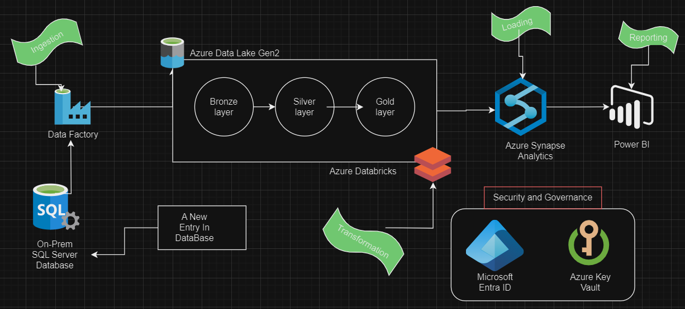

# Azure-Data-engineering-ETL-project

### Introduction
In this project, we are going to create an end-to-end data platform right from Data Ingestion, Data Transformation, Data Loading and Reporting. 
The use case for this project is building an end-to-end solution by ingesting the tables from an on-premise SQL Server database using Azure Data Factory and then storing the data in Azure Data Lake. Then, Azure Databricks is used to transform the RAW data into the cleanest form of data. Then, we are using Azure Synapse Analytics to load the clean data and Microsoft Power BI to integrate with Azure Synapse Analytics to build an interactive dashboard. Also, we use Microsoft Entra ID and Azure Key Vault for monitoring and governance purposes. 

### Architecture

### Service Used
1. **Azure Data Factory:**
   Azure Data Factory is a cloud-based data integration service that allows you to create, schedule, and orchestrate data workflows for moving, transforming, and loading data across various data sources and destinations.

2. **Azure Data Lake Storage Gen2:**
   Azure Data Lake Storage Gen2 is a scalable and secure data lake solution built on Azure Blob Storage, providing features like high throughput, scalability, and integration with Azure services for storing and analyzing large volumes of structured and unstructured data.

3. **Azure Databricks:**
   Azure Databricks is a unified analytics platform built on Apache Spark, designed for data engineering, data science, and machine learning tasks. It offers collaborative notebooks, automated cluster management, and integration with Azure services for scalable data processing and analytics.

4. **Azure Synapse Analytics:**
   Azure Synapse Analytics is an analytics service that brings together enterprise data warehousing and Big Data analytics into a single platform. It provides capabilities for data integration, analytics, and visualization, enabling organizations to derive insights from large and diverse datasets.

5. **Azure Key Vault:**
   Azure Key Vault is a cloud service for securely storing and managing sensitive information such as encryption keys, passwords, and certificates. It helps safeguard cryptographic keys and secrets used by cloud applications and services.

6. **Azure Active Directory (AAD):**
   Azure Active Directory is Microsoft's cloud-based identity and access management service. It provides authentication and authorization services for users, applications, and devices, enabling secure access to Azure resources and other integrated cloud services.

7. **Microsoft Power BI:**
   Microsoft Power BI is a business analytics service that enables users to visualize and analyze data from various sources, create interactive reports and dashboards, and share insights across their organization. It helps organizations make data-driven decisions and drive business performance.

### Project Execution Flow
Extract data from SQL (local)-> data ingestion using Azure data factory using self hosted runtime-> storing the raw data in Bronze in Azure Data Lake Gen2 -> converting the raw data into desired format in two transformations: bronze to silver, then silver to gold -> Loading the data in Azure Synapse Analytics-> Data reporting by integrating it with Microsoft Power BI-> building an interactive dashboard in Microsoft Power BI.
